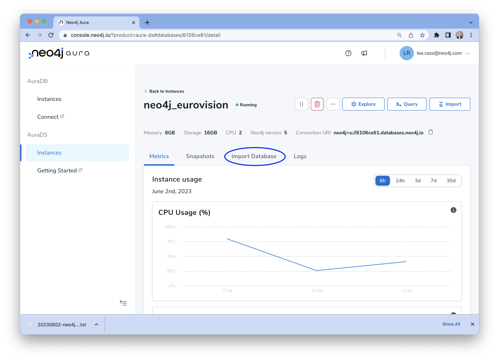
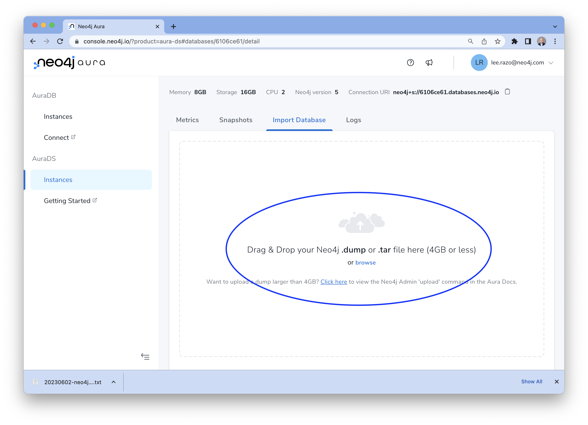
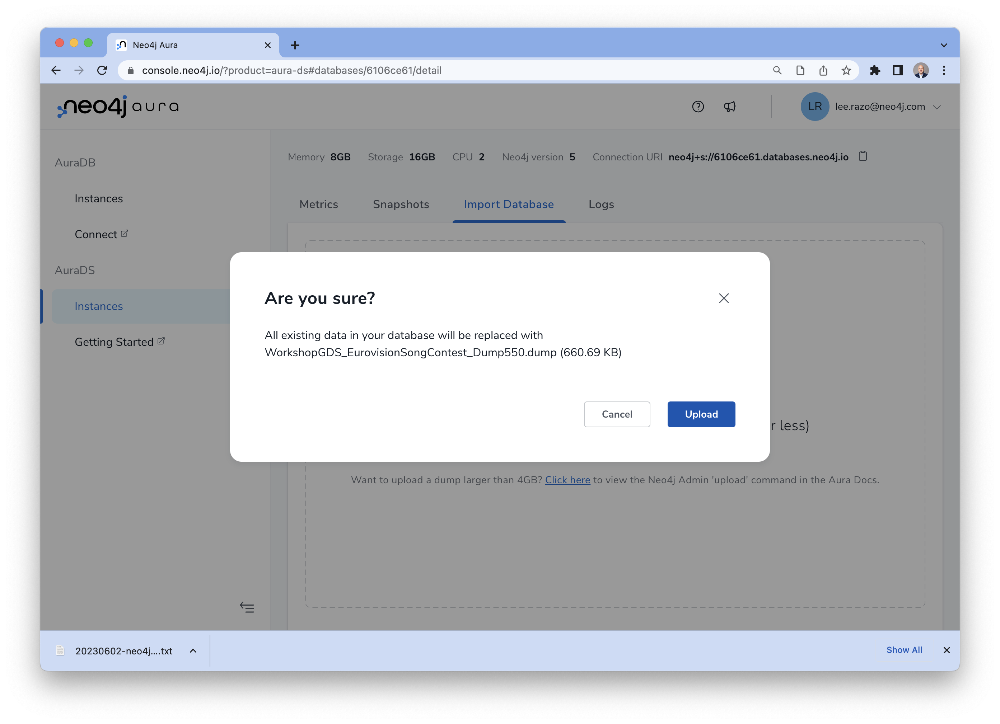
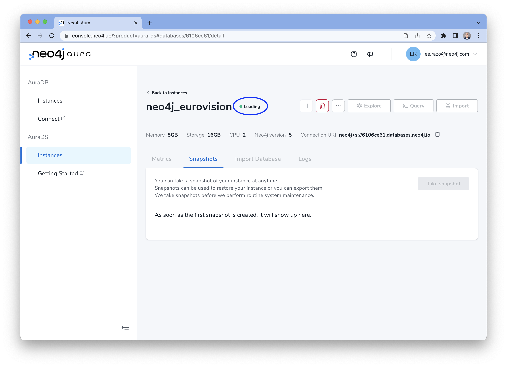
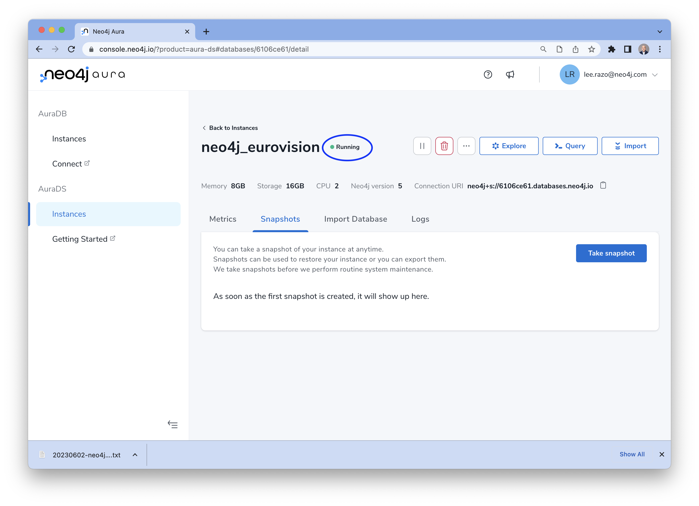

# Lab 3 - Loading Data into Neo4j
There are many different ways to load data into Neo4j. In this lab, we're going to take a backup of a data from an Google Cloud Storage bucket and import it into Neo4j.  

The Neo4j [Data Importer](https://data-importer.neo4j.io/) is another option.  It's a great graphical way to import data.  However, the LOAD CSV option we're using makes it really easy to pull directly from Cloud Storage, so is probably a better choice for what we need.

The native [LOAD CSV](https://neo4j.com/developer/guide-import-csv/) cypher command is a great starting point and handles small- to medium-sized data sets (up to 10 million records). This is perhaps the quickest and simplest way to import data. We won't be using it in this lab, but you can find more information on how to use it at the [link provided](https://neo4j.com/developer/guide-import-csv/).

## Retreiving the backup file and loading it into Neo4j

1. Download the [database backup file from here](https://storage.cloud.google.com/gcp_eurovision_workshop/WorkshopGDS_EurovisionSongContest_Dump550.dump)

2. Go to the [Neo4j AuraDB Managemnt Console](https://console.neo4j.io) and click on the name of the instance you created earlier.

3. Click on the "Import Database" tab in the instance management console.

 

4. Drag and drop the dump file you downloaded in Step 1 or click the "Browse" button and select it from the menu.

 

5. Confirm the upload on the confirmation pop-up window

 

6. After the dump file has been uploaded the instance will go into a "Loading" state. It might take 2-5 minutes for this process to complete before the the data is ready to use.

 

6. The instance and the data is ready to use when the status goes back to "Running"

 

You are now ready to move on to the next lab!