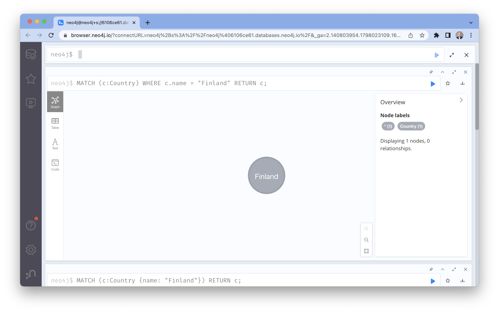

# Lab 4 - Cypher Fundamentals
<!---
In this lab, we're going to take data from an Google Cloud Storage bucket and import it into Neo4j.  There are a few different ways to do this.  We'll start with a very naive LOAD CSV statement and then improve it.  

To load it in Neo4j, let's open the tab that has our Neo4j Workspace in it.  If you don't have that tab open, you can review the previous lab to get into it.

Make sure that "Query" is selected at the top.

-->

You can download the [cypher script for this exercise here](https://storage.googleapis.com/gcp_eurovision_workshop/WorkshopGDS_EurovisionSongContest_Script.cypher). 

So let's start from the beginning!

In Cypher you MATCH a pattern and then RETURN a result

    MATCH (c:Country {name: "Finland"})
    RETURN c;

Filtering is done with WHERE (this statement does exactly the same)

    MATCH (c:Country)
    WHERE c.name = "Finland"
    RETURN c;

### Using Patterns to Answer Questions
Who won in 1975?

    MATCH (c:Country)<-[vote:VOTE_1975_JURY|VOTE_1975_PUBLIC]-()
    RETURN c.name, sum(vote.weight) as score
    ORDER BY score DESC LIMIT 10;

The Netherlands (with Ding-a-Dong) did and you can check at https://eurovisionworld.com/eurovision/1975, the data is correct.
Please take a moment to note down the positions of Finland, Sweden and Ireland (7, 8, 9), this is going to be useful in a bit.

Who won in 2006?

    MATCH (c:Country)<-[vote:VOTE_2006_JURY|VOTE_2006_PUBLIC]-()
    RETURN c.name, sum(vote.weight) as score
    ORDER BY score DESC LIMIT 10;

Finland (Hard Rock Hallelujah) did (https://eurovisionworld.com/eurovision/2006) … just in case you wondered what the music was about.

#### Let's up the ante...
Does country-X almost always give country-Y points?

That clearly requires a couple of definitions:
- almost always → at least 80% of the time
- a minimum of 15 entries for country-Y (otherwise it's not really significant … sorry Australia)
- in order to keep the complexity limited the splitting and renaming of countries is not taken into account (but you could if you wanted to)
- only jury votes are considered

The approach then becomes:
- First you determine how many times a country competed.
- You keep that result with an intermediate projection (WITH) and filter out based on the number of entries (like more than 15)
- You then determine how many times the other countries voted for that country 
- Use another intermediate projection to filter based on the percentage (80%)
- Project the result ordered by relevance 

    MATCH (c:Country)<-[vote:VOTE_2006_JURY|VOTE_2006_PUBLIC]-()
    RETURN c.name, sum(vote.weight) as score
    ORDER BY score DESC LIMIT 10;

    MATCH (target:Country)<-[r]-()
    WHERE NOT type(r) IN ['SPLIT_INTO','WAS_RENAMED’]
    AND NOT type(r) CONTAINS 'PUBLIC'
    WITH target, count(DISTINCT type(r)) AS totalentries
    WHERE totalentries > 15
    MATCH (target)<-[r]-(source:Country)
    WHERE NOT type(r) IN ['SPLIT_INTO','WAS_RENAMED’]
    AND NOT type(r) CONTAINS 'PUBLIC'
    WITH target, source, count(r) as votes, totalentries
    WHERE votes > totalentries * 0.80
    RETURN source.name AS `country-X`, target.name as `country-Y`, votes, totalentries, toFloat(votes)/toFloat(totalentries) as percentage ORDER BY totalentries+votes DESC;

Does country-X almost always give country-Y points?
- It does happen
- But it's not as common as some of the myths would have you believe.

But why does Switzerland usually vote for Italy? 

