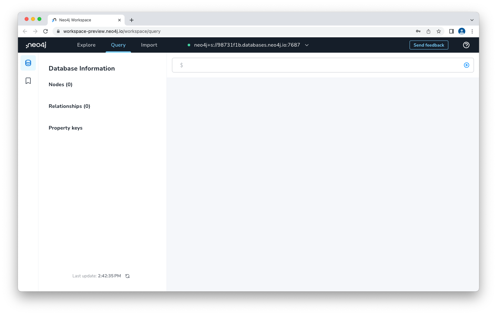

# Lab 4 - Cypher Fundamentals
<!---
In this lab, we're going to take data from an Google Cloud Storage bucket and import it into Neo4j.  There are a few different ways to do this.  We'll start with a very naive LOAD CSV statement and then improve it.  

To load it in Neo4j, let's open the tab that has our Neo4j Workspace in it.  If you don't have that tab open, you can review the previous lab to get into it.

Make sure that "Query" is selected at the top.

-->

You can download the [cypher script for this exercise here](https://storage.googleapis.com/gcp_eurovision_workshop/WorkshopGDS_EurovisionSongContest_Script.cypher). 

So let's start from the beginning!

In Cypher you MATCH a pattern and then RETURN a result

    MATCH (c:Country {name: "Finland"})
    RETURN c;

Filtering is done with WHERE (this statement does exactly the same)

    MATCH (c:Country)
    WHERE c.name = "Finland"
    RETURN c;

Next sentence.