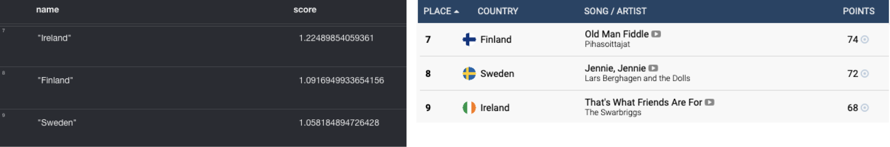
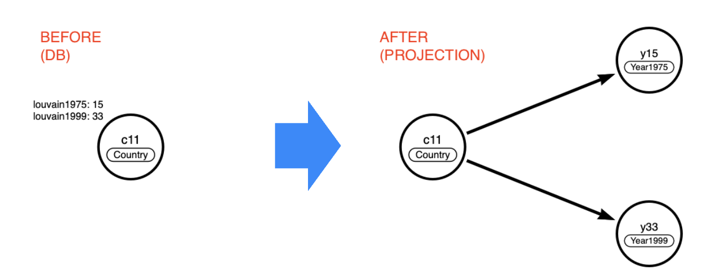
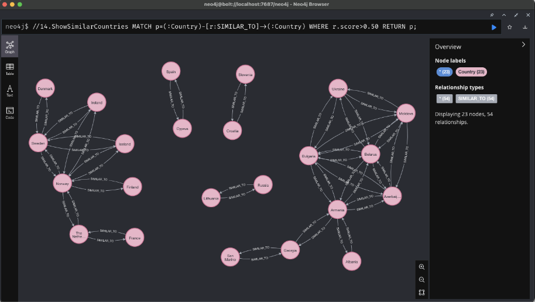

# Lab 5 - Graph Data Science 

#### Using Algorithms to Anser Questions
A typical run of a graph algorithm has the following steps:
1. Know your data. Run some statistics. This will help determine if the results make sense. Run some estimates. Do you have enough memory?
2. Project the necessary data into the in-memory workspace. 
3. Run the algorithm in estimate mode. Run it in stats mode. See 1. for the reason.
4. Run the algorithm. Handle the results.
5. Remove the projection if it is no longer needed.

In this lab we will focus on 2. and 4. (to save time and reduce complexity) but please do not forget the other steps once you are doing this on your own. 

**Who won in 1975?**

This question is asking about the importance of countries in our voting graph. That's a centrality problem and the best known algorithm for it is pageranking so let's apply that!
Project the relevant data into the in-memory workspace

Project the relevant data into the in-memory workspace.

    CALL gds.graph.project("eurosong1975",
      "Country",
      "VOTE_1975_JURY",
      { relationshipProperties: "weight" }
    ) YIELD graphName, nodeCount, relationshipCount
    RETURN graphName, nodeCount, relationshipCount;

Something is not quite right, check https://eurovisionworld.com/eurovision/1975 again, how many countries participated? 

Show an overview of the projections
    CALL gds.graph.list();

Clean up the projection
    CALL gds.graph.drop("eurosong1975");

And try it in a different way …

    CALL gds.graph.project.cypher("eurosong1975",
      "MATCH (c:Country) WHERE EXISTS ((c)-[:VOTE_1975_JURY]-()) RETURN id(c) as id, labels(c) as labels",
      "MATCH (s:Country)-[r:VOTE_1975_JURY]->(t:Country) RETURN id(s) as source, id(t) as target, type(r) as type, r.weight as weight"
    ) YIELD graphName, nodeCount, relationshipCount
    RETURN graphName, nodeCount, relationshipCount;

Native projection VERSUS Cypher projection
-  Native projection is very efficient, scales to huge graphs
-  Native projection requires that your original graph is completely tailored to the problems
-  Cypher projection is less efficient
-  Cypher projection gives you full flexibility (you can even project things that aren't there)

For our hands-on we'll go with Cypher projections, but do keep above in mind!

Streaming the results for 1975

    CALL gds.pageRank.stream("eurosong1975", {
      maxIterations: 20,
      dampingFactor: 0.85,
      relationshipWeightProperty: "weight"
    }) YIELD nodeId, score
    RETURN gds.util.asNode(nodeId).name AS name, score
    ORDER BY score DESC, name ASC LIMIT 10;

Streaming the results for 1975

Does anybody notice something strange about positions 7, 8 and 9?

**A bit of a rant**

Why aren't Finland, Ireland and Sweden in the correct order? Is pageranking giving us information that a plain score can not? Yes and no.

The way pageranking works is that incoming votes are only part of the story. A vote gets more importance if it comes from a page that itself has a high score. Ireland got votes from The Netherlands. The others did not.

The lesson here is that you
- Need to understand your data
- Need to understand the algorithms 

**Let's up the ante**

Going back to the Scandinavian myth…
What were the voting communities in 1975?

    CALL gds.louvain.stream("eurosong1975", {
     relationshipWeightProperty: "weight"
    }) YIELD nodeId, communityId
    RETURN collect(gds.util.asNode(nodeId).name) AS members, communityId
    ORDER BY communityId DESC

Nice, but without looking over all the years there's no way to bust the Scandinavian myth …

Project the remaining years without televoting

    UNWIND range(1976,2015,1) as year
    CALL {
    WITH year
    CALL gds.graph.project.cypher("eurosong" + year,
        "MATCH (c:Country) WHERE EXISTS ((c)-[:VOTE_" + year + "_JURY]-()) RETURN id(c) as id, labels(c) as labels",
        "MATCH (s:Country)-[r:VOTE_" + year + "_JURY]->(t:Country) RETURN id(s) as source, id(t) as target, type(r) as type, r.weight as weight"
    ) YIELD graphName  
    RETURN graphName
    }
    RETURN year, graphName;

Project the remaining years with televoting

    UNWIND range(2016,2018,1) as year
    CALL {
    WITH year
    CALL gds.graph.project.cypher("eurosong" + year,
        "MATCH (c:Country) WHERE EXISTS ((c)-[:VOTE_" + year + "_JURY]-()) RETURN id(c) as id, labels(c) as labels",
        "MATCH (s:Country)-[r:VOTE_" + year + "_JURY|VOTE_" + year + "_PUBLIC]->(t:Country) RETURN id(s) as source, id(t) as target, type(r) as type, r.weight as weight"
    ) YIELD graphName  
    RETURN graphName
    }
    RETURN year, graphName;

Run Louvain in bulk and mutate the in-memory projection

    UNWIND range(1975,2018,1) as year
    CALL {
    WITH year
    CALL gds.louvain.mutate("eurosong" + year, {
        relationshipWeightProperty: "weight",
        mutateProperty: "louvain" + year
    }) YIELD nodePropertiesWritten
    RETURN nodePropertiesWritten
    }
    RETURN year, nodePropertiesWritten;

There are three main modes (ignoring stats and estimate) to run an algorithm

- **stream** - streams the results and is typically either used as a test run (with visual inspection of the results) or when you want to use the results outside of Neo4j (in a machine learning pipeline for example)

- **write** - modifies the original graph, which can be very useful if you want to combine analytics with real time use cases

- **mutate** - modifies the in-memory projection, which is typically done when you have a chain of algorithms where one has to feed into the next

### write, mutate and nodeProperties.write ###

Write mode lets us write back the results to the database.
CALL gds.wcc.write …

Instead of write mode, here we already used mutate, so we could write back the new properties from the projection to the database.

    UNWIND range(1975,2018,1) as year
    CALL {
    WITH year
    CALL gds.graph.nodeProperties.write("eurosong"+year,
                                        ['louvain'+year], ['Country']) 
    YIELD propertiesWritten RETURN propertiesWritten
    } RETURN year, propertiesWritten

**What’s missing to debunk the myth?**

For each Country, for each Year, we have its community.
Now, we need to understand if some Countries shared the same communities over the years. 

Possible approaches:
- Embeddings + KNN
- Node Similarity

**Node Similarity approach**

We have to transform the (variable number of) properties in relationships.
Modeling phase:

**Creating new nodes (Louvain communities per each year)**

    UNWIND range(1975,2018,1) as year1
    CALL {
        WITH year1
        CALL apoc.cypher.run("MATCH (c:Country) 
            RETURN collect(distinct c.louvain"+year1+") as comms", {})
        YIELD value
        WITH year1, value.comms as yearCommunities
        UNWIND yearCommunities as yC
        CALL apoc.merge.node(["Year"+year1], {value: yC})
        YIELD node
        RETURN count(node) as nodeWritten1
    } RETURN year1, nodeWritten1;

Creating new relationships (from Country to Year Louvain Community)

    UNWIND range(1975,2018,1) as year2
    CALL {
        WITH year2
        CALL apoc.cypher.run("MATCH (c:Country) 
      	    WHERE c.louvain"+year2+" IS NOT NULL 
	    RETURN c as node, c.louvain"+year2+" as community", {})
        YIELD value as c WITH year2, c
        CALL apoc.cypher.run("MATCH (y:Year"+year2+") 
	    WHERE y.value = "+c.community+" RETURN y as node", {})
        YIELD value as y WITH year2, c, y
        CALL apoc.create.relationship(c.node, "HAS_COMMUNITY", {}, y.node)
        YIELD rel RETURN count(rel) as nodeWritten2
    } RETURN year2, nodeWritten2;

Creating the projection for Node Similarity

    CALL gds.graph.project("eurosong_communities",
        ['Country','Year1975', 'Year1976', 'Year1977', 'Year1978', 'Year1979',  'Year1980', 'Year1981', 'Year1982', 'Year1983', 'Year1984', 'Year1985', 'Year1986', 'Year1987', 'Year1988', 'Year1989', 'Year1990', 'Year1991', 'Year1992', 'Year1993', 'Year1994', 'Year1995', 'Year1996', 'Year1997', 'Year1998', 'Year1999', 'Year2000', 'Year2001', 'Year2002', 'Year2003', 'Year2004', 'Year2005', 'Year2006', 'Year2007', 'Year2008', 'Year2009', 'Year2010', 'Year2011', 'Year2012', 'Year2013', 'Year2014', 'Year2015', 'Year2016', 'Year2017', 'Year2018’],
        "HAS_COMMUNITY"
    ) YIELD graphName, nodeCount, relationshipCount
    RETURN graphName, nodeCount, relationshipCount;

Run Node Similarity

    CALL gds.nodeSimilarity.write('eurosong_communities’, {
        writeRelationshipType: 'SIMILAR_TO’,
        writeProperty: 'score’,
        similarityCutoff: 0.5
    })
    YIELD nodesCompared, relationshipsWritten

Check the results

    MATCH p=(:Country)-[r:SIMILAR_TO]->(:Country) RETURN p;

#### Confirmed or Debunked? ####

Yes, there is some collusion, but remember, you'd need quite the cluster to actually influence the results significantly. 
And it would seem it's not only the 
Scandinavian countries that have 
that at the moment.

Look at eastern countries too!

### Clean-up ###

First delete the projections from memory

    CALL gds.graph.drop('eurosong_communities')

    UNWIND range(1975,2018,1) as year
    CALL {
        WITH year
        CALL gds.graph.drop('eurosong'+year, false) 
        YIELD graphName RETURN graphName
    } RETURN count(graphName);

Next renove relationships

    MATCH p=()-[r:SIMILAR_TO]->() DELETE r
 
Remove the year nodes
 
    UNWIND range(1975,2018,1) as year
    CALL {
        WITH year
        CALL apoc.cypher.runWrite("MATCH (y:Year"+year1+") 
			        DETACH DELETE y", {})
        YIELD value RETURN count(value) as nodeDeleted
    } RETURN year1, nodeDeleted;

Remove the detected communities
 
    UNWIND range(1975,2018,1) as year
    CALL {
        WITH year
        CALL apoc.cypher.runWrite("MATCH (c:Country) 
    WHERE c.louvain"+year+" IS NOT NULL REMOVE c.louvain"+year, {})
        YIELD value RETURN count(value) as propertiesDeleted
    } RETURN year, propertiesDeleted;